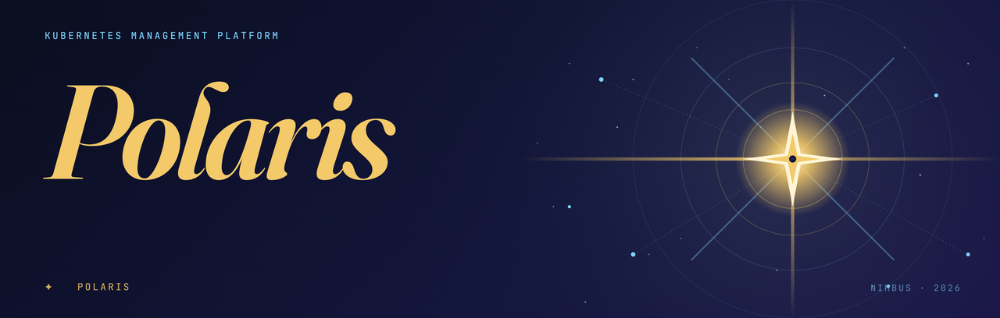
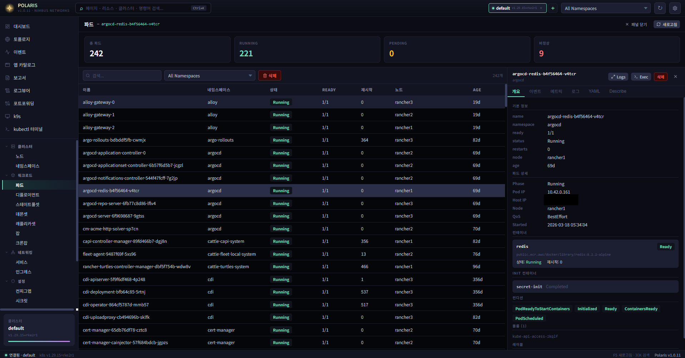
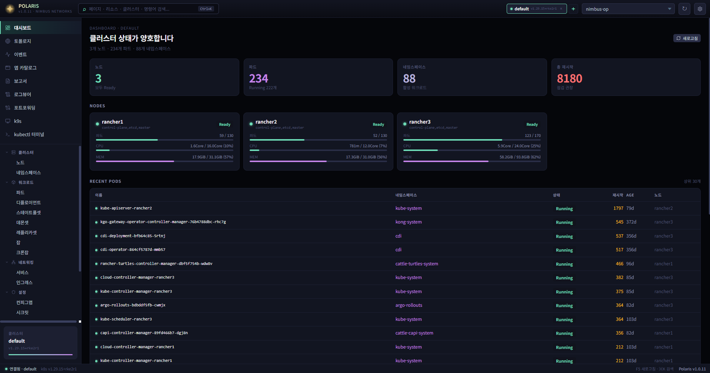
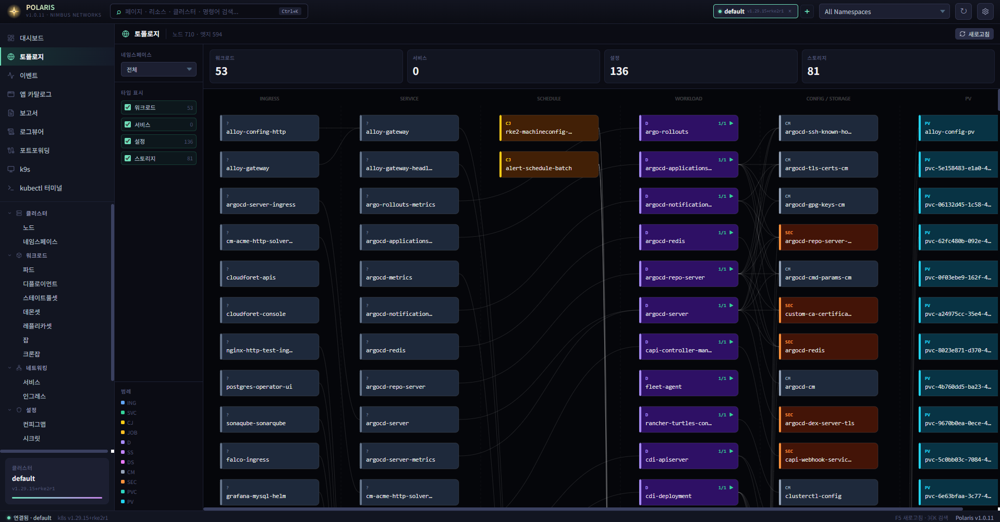
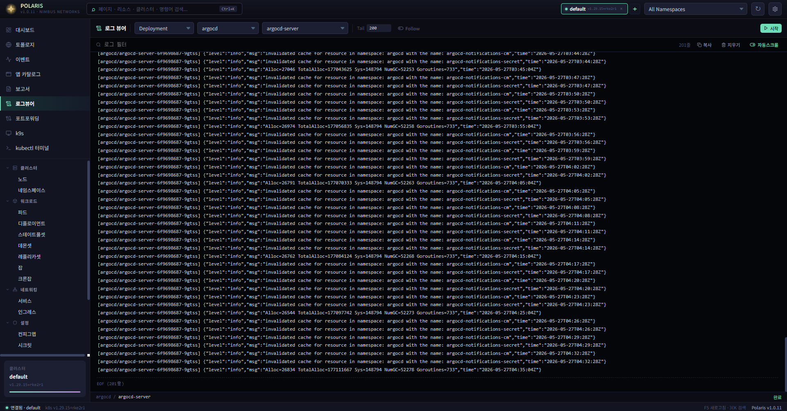

<div align="center">



# POLARIS

### Kubernetes Cluster Management GUI for Windows

**Free Build (no app catalog)** · v1.0.13-e1

[](https://github.com/forestian/polaris/releases)
[](https://github.com/forestian/polaris)
[](#)
[](#)
[](https://github.com/forestian/polaris/actions/workflows/ci.yml)

[**한국어**](#-한국어) · [**English**](#-english)

</div>

---

<a id="-한국어"></a>

<details open>
<summary><h2> 한국어</h2></summary>

### Polaris 란?

윈도우용 **단일 EXE 쿠버네티스 클러스터 관리 데스크톱 앱**.
PyWebView + React 로 만들어졌고, 파이썬 설치 없이 실행됩니다. kubeconfig 로
클러스터에 연결해 리소스 탐색 / 로그 스트리밍 / kubectl/k9s 실행 / DOCX 보고서
생성을 한 UI 에서.

### 스크린샷

<div align="center">

| | |
|:---:|:---:|
|  |  |
| **리소스 브라우저** — 파드 목록 + 우측 상세 패널 | **대시보드** — 클러스터 상태 + 노드 CPU/MEM |
|  |  |
| **토폴로지 그래프** — Ingress → Service → Workload → Config/Storage | **로그 뷰어** — Deployment / StatefulSet 로그 스트리밍 |

</div>

### 다운로드

| 버전 | 다운로드 | 비고 |
|---|---|---|
| **v1.0.13-e1** (최신) | [polaris.exe](https://github.com/forestian/polaris/releases/download/v1.0.13-e1/polaris.exe) | k9s 원클릭 설치 |
| v1.0.12-e1 | [polaris.exe](https://github.com/forestian/polaris/releases/download/v1.0.12-e1/polaris.exe) | 로그/이벤트 저장·복사, 터미널 drag-copy |

> 단일 실행 파일. Python / Node.js 설치 불필요. 유효한 kubeconfig와 Kubernetes API 서버 접근 권한이 있으면 실행 가능합니다.

**무결성 검증** (선택):
- [polaris.exe.sha256](https://github.com/forestian/polaris/releases/download/v1.0.13-e1/polaris.exe.sha256) · [polaris.exe.sha512](https://github.com/forestian/polaris/releases/download/v1.0.13-e1/polaris.exe.sha512)
- **PowerShell**: `Get-FileHash polaris.exe -Algorithm SHA256` → 출력된 Hash 값을 위 파일 내용과 비교
- **Bash / Git Bash** (sha256 파일을 polaris.exe 와 같은 폴더에 두고): `sha256sum -c polaris.exe.sha256` → `polaris.exe: OK`

### ⚠️ Windows SmartScreen 경고

현재 Polaris EXE는 코드서명 인증서로 서명되어 있지 않습니다.
Windows에서 처음 실행할 때 SmartScreen 경고가 표시될 수 있습니다.

공식 [GitHub Releases](https://github.com/forestian/polaris/releases)에서 다운로드한 파일이라면 아래 순서로 실행할 수 있습니다:

1. **추가 정보** 클릭
2. **실행** 클릭

> SHA256/SHA512 체크섬으로 파일 무결성을 먼저 확인하는 것을 권장합니다.  
> 향후 코드서명 적용을 검토 중입니다.

### 주요 기능

#### 코어 클러스터 관리
- **멀티클러스터 탭** — 여러 kubeconfig 동시 연결, 탭으로 전환
- **리소스 브라우저** — 15종 (Pods / Deployments / Services / Ingresses / PVCs / Secrets 등)
- **리소스 상세 패널** — 개요 · 이벤트 · 메트릭 · 로그 · YAML · Describe
- **Secret 자동 마스킹** — base64 토큰 / TLS key 평문 노출 차단
- **검색 / 필터** — 실시간 검색, 네임스페이스 필터, 컬럼 정렬

#### 옵저버빌리티
- **대시보드** — 도넛 차트 3개 (노드 Ready율 / 파드 Running율 / 파드 수용률) + KPI 카드
- **파드 메트릭 그래프** — CPU/Memory 라인 차트 + request/limit 임계선 (5초 폴링)
- **토폴로지 그래프** — 6컬럼 SVG (Ingress → Service → Workload → Config/Storage → PV)
- **클러스터 이벤트** — 리소스별 필터링된 실시간 타임라인

#### 운영
- **kubectl 터미널** — 빌트인 터미널, 스트리밍 명령 자동 감지
- **k9s 런처** — Polaris 컬러 스킴 적용된 Windows Terminal 에서 k9s 실행
- **파드 셸** — 원클릭 `kubectl exec -it ... -- sh` 새 터미널에서
- **포트포워딩 GUI** — 시각적 포트포워드 관리 (시작/중지/목록)
- **CronJob 즉시 실행** — 스케줄 수정 없이 수동 실행
- **리소스 삭제** — 확인 모달로 실수 방지

#### 외부 연동
- **ArgoCD** — Application 목록 / Sync / Rollback / Create / Update / Delete
- **Helm 릴리스** — Helm CLI 또는 K8s Secret 폴백으로 릴리스 조회
- **클러스터 보고서** — DOCX 보고서 생성 (선택적 LLM 분석 포함)

#### UI / UX
- **시스템 트레이 통합**
  - 트레이 아이콘 더블클릭 또는 우클릭 → **"열기"** : 창 복원 (포커스 + 보이기)
  - 트레이 우클릭 → **"종료"** : 완전 종료 (세션 정리 + 전체 클러스터 disconnect + 프로세스 종료)
  - **단일 인스턴스 강제** — 두 번째 EXE 실행 시 새 창 띄우지 않고 기존 창만 활성화
- **세션 자동 복원** — 클러스터 탭 / 활성 탭 / 활성 페이지 / 네임스페이스 모두 복원
- **명령 팔레트** (Ctrl+K) — 어떤 리소스로도 빠르게 이동
- **Windows Terminal 컬러 스킴** — Polaris 프로파일 자동 주입 (k9s / 파드 셸에서 적용)

#### 설정 (타이틀바 우측  아이콘)
- **테마 (배경)** — **6종 컬러 테마 중 선택**, 즉시 적용
  - `polaris` (Polestar Gold · 기본) · `argus` · `aurora` · `forge` · `vault` · `pharos`
  - 각 테마마다 배경 / 텍스트 / 액센트 컬러 세트 다름
- **X 버튼 동작** — `tray` (트레이로 숨김) 또는 `exit` (완전 종료) 토글
  - 기본값은 `tray` — X 눌러도 트레이에만 들어가고 백그라운드에 계속 실행
  - `exit` 로 바꾸면 X 누르면 위 "종료" 와 동일하게 완전 종료
- **세션 자동 복원** — 다음 실행 시 클러스터 탭/페이지 복원 on/off 토글

### Kubernetes 호환성

| 범위 | 상태 |
|---|---|
| **K8s 1.34, 1.35** |  검증 완료 |
| **K8s 1.30 ~ 1.36** |  권장 |
| **K8s 1.22 ~ 1.29** |  코어 기능만 |
| **K8s ≤ 1.21 / ≥ 1.37** |  미검증 |

Polaris 는 v1 stable API (`CoreV1` / `AppsV1` / `BatchV1` / `NetworkingV1` /
`RbacV1` / `StorageV1` / `AutoscalingV1` / `PolicyV1`) 만 사용해 광범위하게 호환됩니다.
선택적 의존: `metrics.k8s.io` (메트릭 그래프), ArgoCD Application CRD (ArgoCD 페이지).

### 빠른 시작

1. [`polaris.exe`](https://github.com/forestian/polaris/releases/download/v1.0.13-e1/polaris.exe) 다운로드
2. 실행 — 설치 불필요
3. 타이틀바 `+` → kubeconfig 탐색
4. 컨텍스트 선택 (또는 현재값 유지) → 연결
5. 둘러보기: 대시보드 → 리소스 → 토폴로지 → 보고서

멀티 클러스터: `+` 한 번 더 클릭 후 다른 kubeconfig 추가. 탭으로 전환.

### 트러블슈팅

**SmartScreen 경고가 표시됩니다**  
공식 GitHub Releases 에서 받은 파일인지 확인 후 SHA256 체크섬을 검증하세요.
이상 없으면 **추가 정보 → 실행** 으로 실행 가능합니다.

**클러스터에 연결되지 않습니다**  
- kubeconfig 경로와 선택한 컨텍스트를 확인하세요
- VPN / 네트워크 연결 상태를 확인하세요
- Kubernetes API 서버에 직접 도달 가능한지 확인하세요 (`kubectl cluster-info`)
- 인증서 오류 또는 프록시 설정을 점검하세요

**메트릭(CPU/MEM)이 표시되지 않습니다**  
파드·노드 메트릭은 클러스터에 `metrics.k8s.io` API가 필요합니다.
`metrics-server` 설치 여부를 확인하거나, 클러스터의 메트릭 API 노출 여부를 점검하세요.

**k9s가 열리지 않습니다**  
Polaris는 k9s를 자동 설치하지 않습니다.
`PATH` 또는 `~/.kube/k9s.exe` 에 k9s를 설치하세요 → [k9s 설치 가이드](https://k9scli.io/topics/install/)

**Helm 릴리스가 보이지 않습니다**  
- `helm` CLI 가 PATH 에 있거나 `~/.kube/helm.exe` 로 설치돼 있는지 확인하세요
- 해당 네임스페이스에 Helm 릴리스 Secret 이 존재하는지 확인하세요

**ArgoCD 페이지가 비어 있습니다**  
ArgoCD 연동은 클러스터에 ArgoCD Application CRD 가 설치돼 있어야 합니다.
ArgoCD가 배포된 클러스터에 연결됐는지 확인하세요.

### 아키텍처 (개발자용)

```
polaris.py            ~100 줄 · 진입점
src/
├── tools.py          외부 CLI 탐색 (kubectl/helm/k9s/WT)
├── k8s.py            K8sManager + 도메인 헬퍼
├── reports.py        DOCX/TXT/HTML 보고서 생성
├── topology.py       토폴로지 그래프 빌더 헬퍼
├── runtime.py        트레이 + 라이프사이클 + 단일 인스턴스
├── _state.py         공유 백그라운드 작업 dict
└── api/              PolarisAPI mixin 합성 (52 public 메서드)
    ├── base.py       APIBase: 공유 상태, 클러스터, 세션, 설정
    ├── connection.py connect/disconnect/kubeconfig
    ├── resources.py  리소스 CRUD, 이벤트, ArgoCD, Helm
    ├── terminal.py   kubectl/k9s/파드 셸
    ├── port_forward.py
    ├── reports.py
    ├── details.py    파드 메트릭, 리소스 YAML/describe
    ├── logs.py       로그 스트리밍
    └── topology.py   토폴로지 데이터
```

기술 스택: **Python 3.12 + kubernetes client + PyWebView + React 18 + Vite + PyInstaller (onefile)**

### 소스에서 빌드

```powershell
# UI
cd ui ; npm install ; npm run build

# Python 의존성
pip install -r requirements.txt

# EXE 빌드 (VERSION/CHANGELOG 동기화 검증, UI 빌드, PyInstaller 실행)
python build.py
# → dist/polaris.exe
```

### 라이선스

**MIT License** — [`LICENSE`](./LICENSE) 파일 참조.
자유롭게 사용·복사·수정·배포·재라이선스·판매 가능. 무보증.

</details>

---
<a id="-english"></a>

<details>
<summary><h2> English</h2></summary>

### What is Polaris?

A **single-EXE desktop application** for managing Kubernetes clusters on Windows.
Built with PyWebView + React, runs without Python installation. Connect to your
clusters via kubeconfig, browse resources, stream logs, run kubectl/k9s, generate
DOCX reports — all from one polished UI.

### Screenshots

<div align="center">

| | |
|:---:|:---:|
|  |  |
| **Resource browser** — pod list with detail panel | **Dashboard** — cluster health + node CPU/MEM |
|  |  |
| **Topology graph** — Ingress → Service → Workload → Config/Storage | **Log viewer** — Deployment / StatefulSet log streaming |

</div>

### Download

| Version | Download | Notes |
|---|---|---|
| **v1.0.13-e1** (latest) | [polaris.exe](https://github.com/forestian/polaris/releases/download/v1.0.13-e1/polaris.exe) | k9s one-click install |
| v1.0.12-e1 | [polaris.exe](https://github.com/forestian/polaris/releases/download/v1.0.12-e1/polaris.exe) | Log/event save & copy, terminal drag-copy |

> Single executable. No Python or Node.js required. Requires a valid kubeconfig and access to a Kubernetes API server.

**Integrity verification** (optional):
- [polaris.exe.sha256](https://github.com/forestian/polaris/releases/download/v1.0.13-e1/polaris.exe.sha256) · [polaris.exe.sha512](https://github.com/forestian/polaris/releases/download/v1.0.13-e1/polaris.exe.sha512)
- **PowerShell**: `Get-FileHash polaris.exe -Algorithm SHA256` → compare the printed Hash with the contents of the .sha256 file
- **Bash / Git Bash** (with the .sha256 file next to polaris.exe): `sha256sum -c polaris.exe.sha256` → `polaris.exe: OK`

### ⚠️ Windows SmartScreen Warning

Polaris EXE is currently not signed with a code-signing certificate.
Windows SmartScreen may display a warning on first launch.

If you downloaded from the official [GitHub Releases](https://github.com/forestian/polaris/releases):

1. Click **More info**
2. Click **Run anyway**

> We recommend verifying the SHA256/SHA512 checksum before running.  
> Code signing is planned for a future release.

### Features

#### Core Cluster Management
- **Multi-cluster tabs** — Connect to multiple kubeconfigs simultaneously, switch with tabs
- **Resource browser** — 15 resource types (Pods/Deployments/Services/Ingresses/PVCs/Secrets etc.)
- **Resource detail panel** — Overview · Events · Metrics · Logs · YAML · Describe
- **Secret auto-masking** — base64 tokens / TLS keys never shown in plain text
- **Search & filter** — Real-time search, namespace filter, column sort

#### Observability
- **Dashboard** — Donut charts (node Ready% · pod Running% · pod capacity%) + KPI cards
- **Pod metrics graphs** — CPU/Memory line charts with request/limit thresholds (5s polling)
- **Topology graph** — 6-column SVG showing Ingress → Service → Workload → Config/Storage → PV
- **Cluster events** — Real-time timeline filtered by resource

#### Operations
- **kubectl terminal** — Built-in terminal with streaming command auto-detection
- **k9s launcher** — Opens k9s in Windows Terminal with Polaris color scheme
- **Pod shell** — One-click `kubectl exec -it ... -- sh` in a new terminal
- **Port-forwarding GUI** — Visual port-forward management (start/stop/list)
- **CronJob trigger** — Manually run CronJobs without modifying schedules
- **Resource deletion** — Confirm modal prevents accidental deletes

#### Integrations
- **ArgoCD** — Application list / Sync / Rollback / Create / Update / Delete
- **Helm releases** — List releases via Helm CLI or fallback to Kubernetes secrets
- **Cluster reports** — Generate comprehensive DOCX reports (LLM-powered insights optional)

#### UI / UX
- **System tray integration**
  - Tray icon double-click or right-click → **"Open"** : restore window (focus + show)
  - Tray right-click → **"Quit"** : full shutdown (clear session + disconnect all clusters + terminate process)
  - **Single-instance enforcement** — launching the EXE again only re-focuses the existing window
- **Session auto-restore** — cluster tabs / active tab / active page / namespace all restored on restart
- **Command palette** (Ctrl+K) — jump to any resource quickly
- **Windows Terminal color scheme** — Polaris profile auto-injected for k9s / pod shell

#### Settings ( icon in titlebar)
- **Theme (background)** — **pick from 6 color themes**, applied instantly
  - `polaris` (Polestar Gold · default) · `argus` · `aurora` · `forge` · `vault` · `pharos`
  - Each theme defines its own background / text / accent palette
- **X button behavior** — toggle between `tray` (hide to tray) and `exit` (full shutdown)
  - Default is `tray` — closing the window only hides it; Polaris keeps running in the tray
  - Set to `exit` to make X behave like the tray "Quit" menu (terminate completely)
- **Session auto-restore** — on/off toggle for restoring cluster tabs/page on next launch

### Kubernetes Compatibility

| Range | Status |
|---|---|
| **K8s 1.34, 1.35** |  Verified |
| **K8s 1.30 ~ 1.36** |  Recommended |
| **K8s 1.22 ~ 1.29** |  Supported (core features only) |
| **K8s ≤ 1.21 / ≥ 1.37** |  Unverified |

Polaris uses only stable v1 APIs (`CoreV1` / `AppsV1` / `BatchV1` / `NetworkingV1` /
`RbacV1` / `StorageV1` / `AutoscalingV1` / `PolicyV1`), so the compatibility range
is very wide. Optional dependencies: `metrics.k8s.io` (for metrics graphs),
ArgoCD Application CRD (for ArgoCD page).

### Quick Start

1. Download [`polaris.exe`](https://github.com/forestian/polaris/releases/download/v1.0.13-e1/polaris.exe)
2. Run it — no installation needed
3. Title bar `+` → Browse your kubeconfig
4. Select a context (or accept current) → Connect
5. Explore: Dashboard → Resources → Topology → Reports

For multi-cluster: click `+` again, add another kubeconfig. Switch with tabs.

### Troubleshooting

**SmartScreen warning appears**  
Verify you downloaded from the official GitHub Releases page and check the SHA256 checksum.
If the file is valid, click **More info → Run anyway**.

**Cannot connect to cluster**  
- Check the kubeconfig path and selected context
- Check VPN / network connectivity
- Verify the Kubernetes API server is reachable (`kubectl cluster-info`)
- Inspect certificate errors or proxy settings

**Metrics (CPU/MEM) are not showing**  
Pod and node metrics require the `metrics.k8s.io` API.
Check whether `metrics-server` is installed or if your cluster exposes the metrics API.

**k9s does not open**  
Polaris does not auto-install k9s.
Install k9s in your `PATH` or at `~/.kube/k9s.exe` → [k9s installation guide](https://k9scli.io/topics/install/)

**Helm releases are not visible**  
- Ensure `helm` is available in your `PATH` or installed at `~/.kube/helm.exe`
- Check that Helm release Secrets exist in the target namespace

**ArgoCD page is empty**  
The ArgoCD integration requires ArgoCD Application CRDs installed in the cluster.
Make sure you are connected to a cluster where ArgoCD is deployed.

### Architecture (for developers)

```
polaris.py            ~100 lines · Entry point
src/
├── tools.py          External CLI discovery (kubectl/helm/k9s/WT)
├── k8s.py            K8sManager + domain helpers
├── reports.py        DOCX/TXT/HTML report generation
├── topology.py       Topology graph builder helpers
├── runtime.py        Tray + lifecycle + single-instance
├── _state.py         Shared background-job dicts
└── api/              PolarisAPI mixin composition (52 public methods)
    ├── base.py       APIBase: shared state, clusters, session, settings
    ├── connection.py connect/disconnect/kubeconfig
    ├── resources.py  Resource CRUD, events, ArgoCD, Helm
    ├── terminal.py   kubectl/k9s/pod shell
    ├── port_forward.py
    ├── reports.py
    ├── details.py    Pod metrics, resource YAML/describe
    ├── logs.py       Log streaming
    └── topology.py   Topology data
```

Tech stack: **Python 3.12 + kubernetes client + PyWebView + React 18 + Vite + PyInstaller (onefile)**

### Build from source

```powershell
# UI
cd ui ; npm install ; npm run build

# Python deps
pip install -r requirements.txt

# Build EXE (validates VERSION/CHANGELOG sync, builds UI, runs PyInstaller)
python build.py
# → dist/polaris.exe
```

### License

Released under the **MIT License** — see [`LICENSE`](./LICENSE).
Free to use, copy, modify, merge, publish, distribute, sublicense, and sell.
No warranty.

</details>

---

<div align="center">

**Polaris** · _North star of your clusters_

Powered by PyWebView + React + kubernetes-client

</div>
